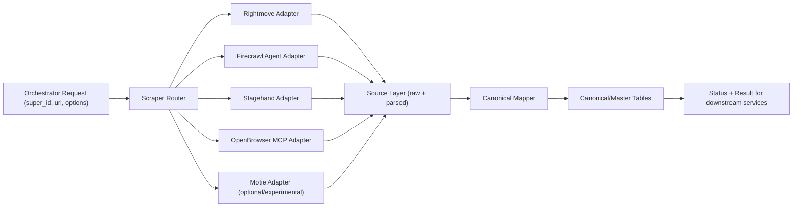

# Scraper Service Structure (Single Service, Multiple Scrapers)

## Goal
Run multiple domain/method scrapers inside **one** scraper service, with a DB design that is easy to extend to scraper #2, #3, #4 without rewrites.

## High-Level Shape



## Service Folder Structure

```text
scraper_service/
  src/scraper_service/
    main.py
    config.py
    db.py
    routers/
      scrape_router.py
      health_router.py
    orchestration/
      router.py                  # selects adapter and fallback path
      policies.py                # completeness thresholds, retry/fallback policy
    adapters/
      base.py                    # adapter interface
      rightmove_adapter.py
      firecrawl_agent_adapter.py
      stagehand_adapter.py
      openbrowser_mcp_adapter.py
      motie_adapter.py           # optional/experimental
    mappers/
      canonical_mapper.py        # source -> canonical mapping
      field_registry.py          # canonical fields and normalization helpers
    models/
      source_models.py
      canonical_models.py
      workflow_models.py
    services/
      scrape_pipeline.py         # fetch -> parse -> score -> persist
      completeness.py
      status_notifier.py
    tests/
      adapters/
      integration/
      unit/
```

## Adapter Contract (all scrapers implement this)

```python
class ScraperAdapter(Protocol):
    name: str
    supported_domains: list[str]

    async def fetch_raw(self, request: ScrapeRequest) -> RawScrapeResult: ...
    async def parse(self, raw: RawScrapeResult) -> ParsedScrapeResult: ...
    async def score(self, parsed: ParsedScrapeResult) -> CompletenessScore: ...
```

Rule: new scraper = one new adapter module + tests + mapping config.  
No new microservice required.

## Router Rules
- First pass: domain-based routing (`rightmove`, `zoopla`, etc.).
- If no direct match: use generic/browser-capable adapter.
- Fallback triggers when:
  - adapter hard-fails, or
  - completeness score is below threshold.

Example order:
1. Domain-specific adapter (if exists)
2. Firecrawl Agent or Stagehand
3. OpenBrowser MCP fallback

## Database Structure (Two-Hop, Minimal Complexity)

Use one DB with two layers:

### 1) Source Layer (per adapter, append-only)
- `scrape_runs`
  - `id`, `super_id`, `target_url`, `selected_adapter`, `status`, `started_at`, `finished_at`
- `source_raw_records`
  - `id`, `run_id`, `adapter`, `source_domain`, `payload_json`, `http_meta_json`, `created_at`
- `source_parsed_records`
  - `id`, `run_id`, `adapter`, `parsed_json`, `completeness_score`, `confidence_score`, `created_at`

Notes:
- Keep adapter-specific odd fields in JSONB.
- Avoid creating many relational tables per adapter at first.

### 2) Canonical/Master Layer (stable for downstream)
- `canonical_property_snapshot`
  - `id`, `super_id`, `run_id`, `source_adapter`, `source_url`
  - core columns (`address`, `price`, `beds`, `baths`, `property_type`, etc.)
  - `extras_json` (unmapped/rare fields)
  - `created_at`
- `canonical_media`
  - `id`, `snapshot_id`, `media_type`, `url`, `caption`, `sort_order`
- `canonical_events`
  - `id`, `super_id`, `context`, `status`, `summary_json`, `created_at`

## Why this structure
- Easy to add adapters quickly.
- Keeps full source audit trail.
- Avoids early over-normalization and table explosion.
- Makes recovery easy:
  - `two-hop -> one-hop`: bypass mapper and write canonical directly.
  - `one-hop -> two-hop`: expensive rewrite/backfill (avoid this first).

## Add-a-New-Scraper Checklist
1. Add adapter module under `adapters/`.
2. Register it in router policy.
3. Add mapping config in `mappers/`.
4. Add adapter tests + one integration test.
5. Deploy with feature flag (`SCRAPER_<NAME>_ENABLED=true`).

## Phase-1 Default Adapters
- `rightmove_adapter`
- `firecrawl_agent_adapter`
- `stagehand_adapter`
- `openbrowser_mcp_adapter`
- `motie_adapter` (only if validated and stable in your environment)
